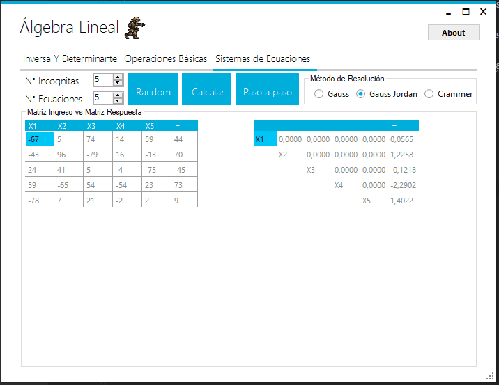
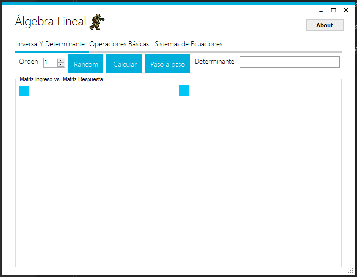

Este repositorio quizá sea mi primer trabajo como desarrollador freelance, ya hace muchos años lo desarrollé para unos estudiantes de otra universidad, que irónicamente estaban estudiando Ingeniería informatica.

El código no está del todo limpio ya que para ser mi primer trabajo, y desarrollando solo, no me preocupaba que mis aplicaciones sean escalables ni mantenibles con el tiempo.

Desarrollaba con el pseudonimo de Solomon Aternus (Quien sabe por qué, cosas de la juventud en extasis XD)

## Observaciones:
El algoritmo que resuelve las determinantes o los sistemas de ecuaciones no esta muy bien optimizado, me atrevo a decir que es de complejidad cúbica, y quizá un poco más debido a mi descuido de aquel entonces.

Lo interesante del proyecto, es que te muestra el paso a paso de como se resuelve dichas operaciones matriciales.

Usé MetroFramework© para el formato de las Ventanas, ya que no me simpatizaba el que tiene por defecto WinForms.

Y puse algo como una suerte de EasterEgg en la Ventana del About XD.

- # Cómo Usarlo

  Solo es cuestion de Poner valores dentro de la matriz y calcular. Si quieres ver el paso a paso, te mostrará en modo Consola como se resolvió el problema.

El programa puede calcular la inversa de una matriz cuadrada, calcula operaciones básicas matriciales, y resuelve sistemas de ecuaciones en teoria hasta de 100 ecuaciones con 100 incognitas
